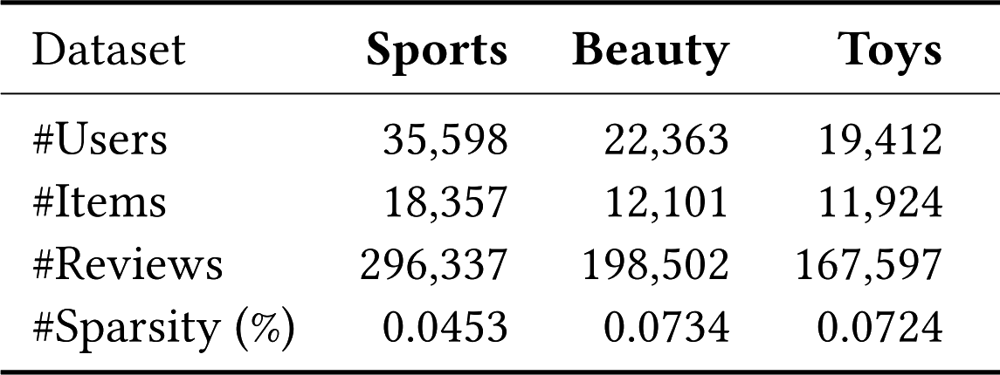

# Available Datasets

## AmazonDataset

The Amazon Dataset is a processed implementation of the Amazon Dataset provided by the author's of 
the [P5 Paper](https://arxiv.org/pdf/2203.13366.pdf). There are three available splits (*beauty*, *sports*, *toys*) with
the following statistics (*image taken from the mentioned P5 paper*):

{: style="display:block;max-width:70%;margin-left:auto;margin-right:auto"}

For each ***user***, the following information is available:

- The *sequence* of bought items
- The *rating* assigned to each item

For each ***item***, the following information is available:

- *Description*
- *Categories*
- *Title*
- *Price*
- *Image URL*
- *Brand*

```yaml title="AmazonDataset parameters"
AmazonDataset:
  
  # The Amazon dataset split to use. Can be 'beauty', 'sports', 'toys'
  #
  # Required
  dataset_name: toys
  
  # If set to true, users and items ids will have "user_" and "item_" prefix in the dataset
  # E.g.:
  # add_prefix_items_users: false -> users = [1, 2, 3, ...]; items = [1, 2, 3, ...]
  # add_prefix_items_users: true -> users = [user_1, user_2, user_3, ...]; items = [item_1, item-2, item_3, ...]
  #
  # Optional, Default: true
  add_prefix_items_users: true
  
  # If set to true item ids will start from 1001 rather than 1  # (1)
  # E.g.:
  # items_start_from_1001: false -> items = [1, 2, 3, ...]
  # items_start_from_1001: true -> items = [1001, 1002, 1003, ...]
  items_start_from_1001: false
```

1. This is to fully exploit the LLM model tokenization: with *sequential indexing*, items with similar id should have
   ***more importance***, thus by starting item ids from *1001* rather than *1* the *sentencepiece* tokenizer will 
   tokenize with **same subtokens** items with similar ids!
   For more details check the [following paper](https://arxiv.org/pdf/2305.06569.pdf)