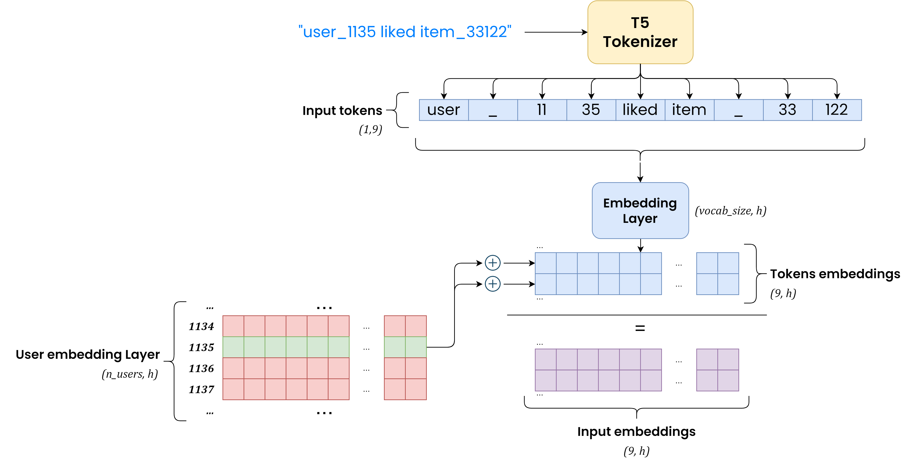

# Available models

## T5Rec

This model implements [T5](https://huggingface.co/docs/transformers/model_doc/t5) for the recommendation setting.
It is implemented by using the **HuggingFace** library, thus you can pass to the model any parameters that you would 
pass to the [T5Config](https://huggingface.co/docs/transformers/model_doc/t5#transformers.T5Config) and to the
[GenerationConfig](https://huggingface.co/docs/transformers/main_classes/text_generation#transformers.GenerationConfig).

!!! info
    Some GenerationConfig parameters have default value for *T5Rec*:
    
    - `num_return_sequences = 10`
    - `num_beams = 30`
    - `no_repeat_ngram_size = 0`
    - `early_stopping = True`
    
    **Remember:** For non-ranking task, `num_return_sequences` will be set to 1 when generating predictions regardless
    of what you set in the .yaml file


```yaml title="T5Rec"
T5Rec:
    
    
  # The checkpoint that should be used as starting point of the
  # fine-tuning process. It can be a model name hosted at hugging face
  # or a local path # (1)
  # 
  # Required
  name_or_path: "google/flan-t5-small"
  
  # If set to true, this adds an EmbeddingLayer to the model which tries to encode user information
  # from their ids, and project the encoded representation in the hidden dimension space of the
  # chosen model. The user encoded information is then summed to the encoded information of each token in the
  # input prompt, with the idea of "translating" the encoded input to a specific region in the latent space.
  # This sum is later passed to the forward method of the T5 model
  #
  # Optional, Default: false
  inject_user_embeds: false
  
  # If set to true, this adds a custom EmbeddingLayer to the model which encodes whole word information.
  # This encoding produces embeddings which have same hidden dimension of the input embeddings, and the two
  # are summed together. This is basically the implementation of the P5 architecture # (4)
  #
  # Optional, Default: false
  inject_whole_word_embeds: false
  
  # You can pass any parameter that you would pass to the T5Config when instantiating the model with the
  # HuggingFace library # (4)
  CONFIG_PARAM_1: CONFIG_VAL_1
  CONFIG_PARAM_2: CONFIG_VAL_2
  ... 
  
  # You can pass any parameter that you would pass to the GenerationConfig when instantiating it with the
  # HuggingFace library # (5)
  GEN_PARAM_1: GEN_VAL_1
  GEN_PARAM_2: GEN_VAL_2
  ...
```

1. Check all the [available models](https://huggingface.co/models?sort=trending&search=t5) hosted at HuggingFace!
2. More robust strategy, but slower
3. Less robust strategy, but faster
4. The P5 model is described in [this](https://arxiv.org/pdf/2203.13366.pdf) research paper
5. Check all the config parameters that you can pass from the HuggingFace
   official [documentation](https://huggingface.co/docs/transformers/model_doc/t5#transformers.T5Config)
6. Check all the generation parameters that you can pass from the HuggingFace
   official [documentation](https://huggingface.co/docs/transformers/main_classes/text_generation#transformers.GenerationConfig)


This is a visualization of what `inject_user_embeds` set to `true` does:

{: style="display:block;max-width:90%;margin-left:auto;margin-right:auto"}

This is a visualization of what `inject_whole_word_embeds` set to `true` does:

{: style="display:block;max-width:90%;margin-left:auto;margin-right:auto"}

---

## GPT2Rec

This model implements [GPT2](https://huggingface.co/docs/transformers/model_doc/gpt2) for the recommendation setting.
It is implemented by using the **HuggingFace** library, thus you can pass to the model any parameters that you would 
pass to the [GPT2Config](https://huggingface.co/docs/transformers/model_doc/gpt2#transformers.GPT2Config) and to the
[GenerationConfig](https://huggingface.co/docs/transformers/main_classes/text_generation#transformers.GenerationConfig).

Since GPT2 is a *text-generation* model, **input text** and **target text** of the specific task are "merged" into a 
single prompt with prefix ***Input:*** and ***Target:*** respectively

!!! info
    Some GenerationConfig parameters have default value for *GPT2Rec*:
    
    - `num_return_sequences = 10`
    - `max_length = TOKENIZER_MAX_LENGTH`
    - `no_repeat_ngram_size = 0`
    - `early_stopping = True`
    
    **Remember:**

    - For non-ranking task, `num_return_sequences` will be set to 1 when generating predictions regardless
      of what you set in the .yaml file
    - `max_length` is set to the tokenizer max length since, when performing generation, the whole input text
      is being generated back and not only the target text!


```yaml title="GPT2Rec"
GPT2Rec:
    
    
  # The checkpoint that should be used as starting point of the
  # fine-tuning process. It can be a model name hosted at hugging face
  # or a local path # (1)
  # 
  # Required
  name_or_path: "gpt2"
  
  # You can pass any parameter that you would pass to the T5Config when instantiating the model with the
  # HuggingFace library # (4)
  CONFIG_PARAM_1: CONFIG_VAL_1
  CONFIG_PARAM_2: CONFIG_VAL_2
  ... 
  
  # You can pass any parameter that you would pass to the GenerationConfig when instantiating it with the
  # HuggingFace library # (5)
  GEN_PARAM_1: GEN_VAL_1
  GEN_PARAM_2: GEN_VAL_2
  ...
```

1. Check all the [available models](https://huggingface.co/models?sort=trending&search=gpt2) hosted at HuggingFace!
2. More robust strategy, but slower
3. Less robust strategy, but faster
4. Check all the config parameters that you can pass from the HuggingFace
   official [documentation](https://huggingface.co/docs/transformers/model_doc/gpt2#transformers.GPT2Config)
5. Check all the generation parameters that you can pass from the HuggingFace
   official [documentation](https://huggingface.co/docs/transformers/main_classes/text_generation#transformers.GenerationConfig)