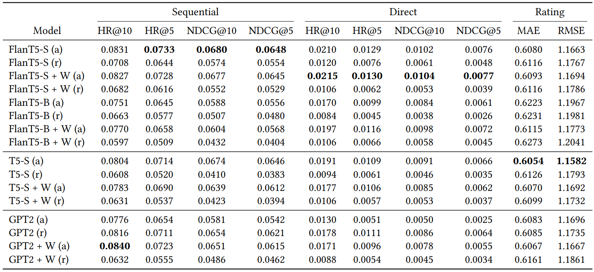
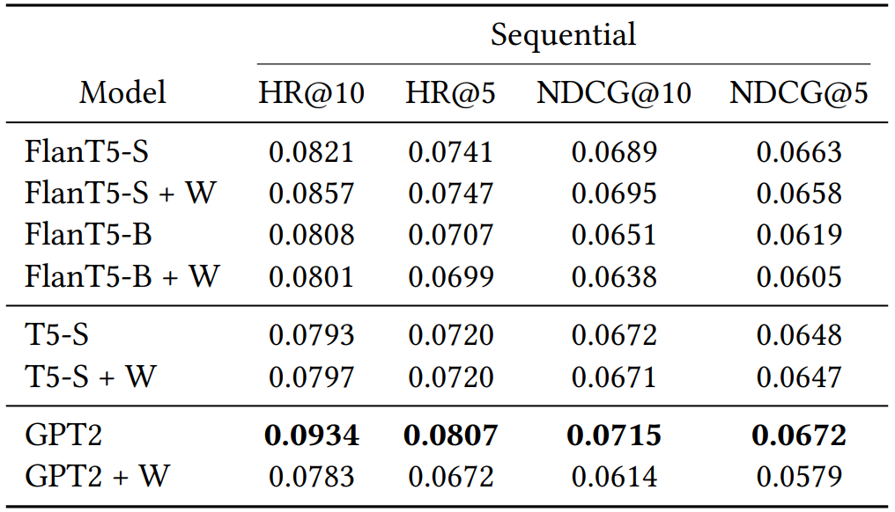

# Sample Experiments

This directory contains all the `.yml` config files and results of multiple experiment runs: they were all made
to test the efficacy of *LaikaLLM*. Majority of the runs overcame the state-of-the-art set by [P5](https://arxiv.org/pdf/2203.13366.pdf).
Each result directory contains a table storing metrics results for each task in both `.csv` and `.tex` format, generated with *LaikaLLM*.

Each of the following runs has also been tracked with **WandB**. The full workspace is available by clicking the following image:

  

## Multitask results

These are the results of all the considered models when trained and evaluated on the *Sequential*, *Direct* and *Rating Prediction* tasks:

    

### Flan T5 Runs
- **FlanT5-S (a)**: `google/flan-t5-small` trained and evaluated on Sequential, Direct, Rating Prediction task with train task selection strategy `all` [[.yml config](flan-t5/flan_t5_full_all.yml)][[Results directory](flan-t5/metrics_results/flan_t5_full_all)][[Visualize in WandB](https://wandb.ai/silleellie/LaikaLLM/runs/mb0rn9a8)]

- **FlanT5-S (r)**: `google/flan-t5-small` trained and evaluated on Sequential, Direct, Rating Prediction task with train task selection strategy `random` [[.yml config](flan-t5/flan_t5_full_random.yml)][[Results directory](flan-t5/metrics_results/flan_t5_full_random)][[Visualize in WandB](https://wandb.ai/silleellie/LaikaLLM/runs/3kpr4nas)]

- **FlanT5-S + W (a)**: `google/flan-t5-small` with the injection of `whole word embeddings` trained and evaluated on Sequential, Direct, Rating Prediction task with train task selection strategy `all` [[.yml config](flan-t5+w/flan_t5+w_full_all.yml)][[Results directory](flan-t5+w/metrics_results/flan_t5+w_full_all)][[Visualize in WandB](https://wandb.ai/silleellie/LaikaLLM/runs/mfi0zvjs)]

- **FlanT5-S + W (r)**: `google/flan-t5-small` with the injection of `whole word embeddings` trained and evaluated on Sequential, Direct, Rating Prediction task with train task selection strategy `random` [[.yml config](flan-t5+w/flan_t5+w_full_random.yml)][[Results directory](flan-t5+w/metrics_results/flan_t5+w_full_random)][[Visualize in WandB](https://wandb.ai/silleellie/LaikaLLM/runs/7n03oosq)]

- **FlanT5-B (a)**: `google/flan-t5-base` trained and evaluated on Sequential, Direct, Rating Prediction task with train task selection strategy `all` [[.yml config](flan-t5/flan_t5_base_full_all.yml)][[Results directory](flan-t5/metrics_results/flan_t5_base_full_all)][[Visualize in WandB](https://wandb.ai/silleellie/LaikaLLM/runs/73ig86hu)]

- **FlanT5-B (r)**: `google/flan-t5-base` trained and evaluated on Sequential, Direct, Rating Prediction task with train task selection strategy `random` [[.yml config](flan-t5/flan_t5_base_full_random.yml)][[Results directory](flan-t5/metrics_results/flan_t5_base_full_random)][[Visualize in WandB](https://wandb.ai/silleellie/LaikaLLM/runs/x8fmesms)]

- **FlanT5-B + W (a)**: `google/flan-t5-base` with the injection of `whole word embeddings` trained and evaluated on Sequential, Direct, Rating Prediction task with train task selection strategy `all` [[.yml config](flan-t5+w/flan_t5+w_base_full_all.yml)][[Results directory](flan-t5+w/metrics_results/flan_t5+w_base_full_all)][[Visualize in WandB](https://wandb.ai/silleellie/LaikaLLM/runs/oxxjo006)]

- **FlanT5-B + W (r)**: `google/flan-t5-base` with the injection of `whole word embeddings` trained and evaluated on Sequential, Direct, Rating Prediction task with train task selection strategy `random` [[.yml config](flan-t5+w/flan_t5+w_base_full_random.yml)][[Results directory](flan-t5+w/metrics_results/flan_t5+w_base_full_random)][[Visualize in WandB](https://wandb.ai/silleellie/LaikaLLM/runs/efba0es8)]

### T5 runs
- **T5-S (a)**: `t5-small` trained and evaluated on Sequential, Direct, Rating Prediction task with train task selection strategy `all` [[.yml config](t5/t5_full_all.yml)][[Results directory](t5/metrics_results/t5_full_all)][[Visualize in WandB](https://wandb.ai/silleellie/LaikaLLM/runs/rrve3o96)]

- **T5-S (r)**: `t5-small` trained and evaluated on Sequential, Direct, Rating Prediction task with train task selection strategy `random` [[.yml config](t5/t5_full_random.yml)][[Results directory](t5/metrics_results/t5_full_random)][[Visualize in WandB](https://wandb.ai/silleellie/LaikaLLM/runs/bxw0sogy)]

- **T5-S + W (a)**: `t5-small` with the injection of `whole word embeddings` trained and evaluated on Sequential, Direct, Rating Prediction task with train task selection strategy `all` [[.yml config](t5+w/t5+w_full_all.yml)][[Results directory](t5+w/metrics_results/t5+w_full_all)][[Visualize in WandB](https://wandb.ai/silleellie/LaikaLLM/runs/tcqrvyon)]

- **T5-S + W (r)**:`t5-small` with the injection of `whole word embeddings` trained and evaluated on Sequential, Direct, Rating Prediction task with train task selection strategy `random` [[.yml config](t5+w/t5+w_full_random.yml)][[Results directory](t5+w/metrics_results/t5+w_full_random)][[Visualize in WandB](https://wandb.ai/silleellie/LaikaLLM/runs/he9ypxdb)]

### GPT2 Runs
- **GPT2 (a)**: `gpt2` trained and evaluated on Sequential, Direct, Rating Prediction task with train task selection strategy `all` [[.yml config](gpt2/gpt2_full_all.yml)][[Results directory](gpt2/metrics_results/gpt2_full_all)][[Visualize in WandB](https://wandb.ai/silleellie/LaikaLLM/runs/iyd0whix)]

- **GPT2 (r)**: `gpt2` trained and evaluated on Sequential, Direct, Rating Prediction task with train task selection strategy `random` [[.yml config](gpt2/gpt2_full_random.yml)][[Results directory](gpt2/metrics_results/gpt2_full_random)][[Visualize in WandB](https://wandb.ai/silleellie/LaikaLLM/runs/0kc6nh03)]

- **GPT2 + W (a)**: `gpt2` with the injection of `whole word embeddings` trained and evaluated on Sequential, Direct, Rating Prediction task with train task selection strategy `all` [[.yml config](gpt2+w/gpt2+w_full_all.yml)][[Results directory](gpt2+w/metrics_results/gpt2+w_full_all)][[Visualize in WandB](https://wandb.ai/silleellie/LaikaLLM/runs/vpeb84av)]

- **GPT2 + W (r)**: `gpt2` with the injection of `whole word embeddings` trained and evaluated on Sequential, Direct, Rating Prediction task with train task selection strategy `random` [[.yml config](gpt2+w/gpt2+w_full_random.yml)][[Results directory](gpt2+w/metrics_results/gpt2+w_full_random)][[Visualize in WandB](https://wandb.ai/silleellie/LaikaLLM/runs/sve0j31i)]

## Best sequential task results

These are the results of all the considered models when trained and evaluated only on the *Sequential* task:

    

### Flan T5 Runs
- **FlanT5-S**: `google/flan-t5-small` trained and evaluated on the Sequential task alone [[.yml config](flan-t5/flan_t5_seq.yml)][[Results directory](flan-t5/metrics_results/flan_t5_seq)][[Visualize in WandB](https://wandb.ai/silleellie/LaikaLLM/runs/2t521nr4)]

- **FlanT5-S + W**: `google/flan-t5-small` with the injection of `whole word embeddings` trained and evaluated on the Sequential task alone [[.yml config](flan-t5+w/flan_t5+w_seq.yml)][[Results directory](flan-t5+w/metrics_results/flan_t5+w_seq)][[Visualize in WandB](https://wandb.ai/silleellie/LaikaLLM/runs/cuz0hguh)]

- **FlanT5-B**: `google/flan-t5-base` trained and evaluated on the Sequential task alone [[.yml config](flan-t5/flan_t5_base_seq.yml)][[Results directory](flan-t5/metrics_results/flan_t5_base_seq)][[Visualize in WandB](https://wandb.ai/silleellie/LaikaLLM/runs/f5l9lzm5)]

- **FlanT5-B + W**: `google/flan-t5-base` with the injection of `whole word embeddings` trained and evaluated on the Sequential task alone [[.yml config](flan-t5+w/flan_t5+w_base_seq.yml)][[Results directory](flan-t5+w/metrics_results/flan_t5+w_base_seq)][[Visualize in WandB](https://wandb.ai/silleellie/LaikaLLM/runs/our9jkc3)]

### T5 runs
- **T5-S**: `t5-small` trained and evaluated on the Sequential task alone [[.yml config](t5/t5_seq.yml)][[Results directory](t5/metrics_results/t5_seq)][[Visualize in WandB](https://wandb.ai/silleellie/LaikaLLM/runs/jv3dqr74)]

- **T5-S + W**: `t5-small` with the injection of `whole word embeddings` trained and evaluated on the Sequential task alone [[.yml config](t5+w/t5+w_seq.yml)][[Results directory](t5+w/metrics_results/t5+w_seq)][[Visualize in WandB](https://wandb.ai/silleellie/LaikaLLM/runs/4y3idqj5)]

### GPT2 Runs
- **GPT2**: `gpt2` model trained and evaluated on the Sequential task alone [[.yml config](gpt2/gpt2_seq.yml)][[Results directory](gpt2/metrics_results/gpt2_seq)][[Visualize in WandB](https://wandb.ai/silleellie/LaikaLLM/runs/jzmgz2p9)]

- **GPT2 + W**: `gpt2` with the injection of `whole word embeddings` model trained and evaluated on the Sequential task alone [[.yml config](gpt2+w/gpt2+w_seq.yml)][[Results directory](gpt2+w/metrics_results/gpt2+w_seq)][[Visualize in WandB](https://wandb.ai/silleellie/LaikaLLM/runs/dnw1ope5)]
