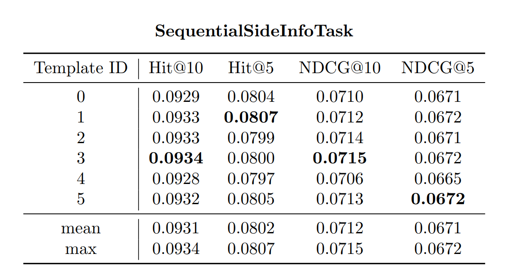
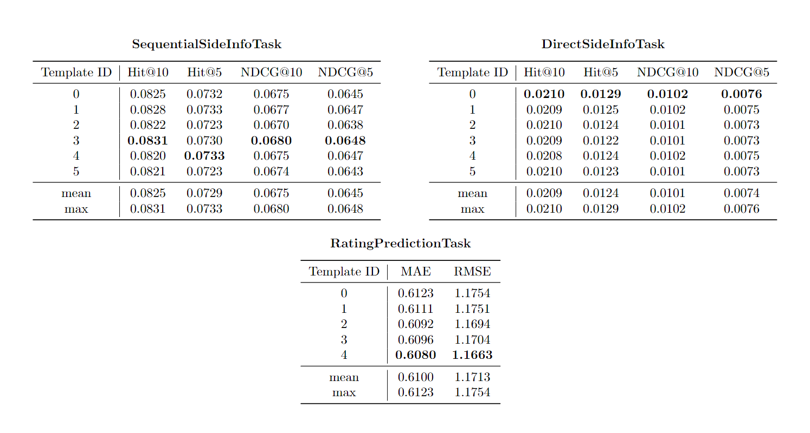

# Sample Experiments

This directory contains all the `.yml` config files and results of multiple experiment runs: they were all made
to test the efficacy of *LaikaLLM*. All runs overcame the state-of-the-art set by [P5](https://arxiv.org/pdf/2203.13366.pdf).
Each result directory contains a table storing metrics results for each task in both `.csv` and `.tex` format, generated with *LaikaLLM*.

Each of the following runs has also been tracked with **WandB**. The full workspace is available by clicking the following image:

  

## Best sequential task results

[[.yml config](gpt2/gpt2_seq.yml)] [[Results directory](gpt2/metrics_results/gpt2_seq)]

The model which yielded the best results when trained on Sequential task alone is the ***gpt2*** model

    

## Best multitask results

[[.yml config](flan-t5/flan_t5_full_all.yml)][[Results directory](flan-t5/metrics_results/flan_t5_full_all)]

The model which yielded the best results when trained on Sequential, Direct and Rating Prediction Task is the ***flan-t5-small*** model 

    

## All runs

### T5 runs
- `t5-small` trained and evaluated on the Sequential task alone
[[.yml config](t5/t5_seq.yml)][[Results directory](t5/metrics_results/t5_seq)][[Visualize in WandB](https://wandb.ai/silleellie/LaikaLLM/runs/go1k5yvh)]

- `t5-small` trained and evaluated on Sequential, Direct, Rating Prediction task with train task selection strategy `random` [[.yml config](t5/t5_full_random.yml)][[Results directory](t5/metrics_results/t5_full_random)][[Visualize in WandB](https://wandb.ai/silleellie/LaikaLLM/runs/tc9i2f2n)]

- `t5-small` trained and evaluated on Sequential, Direct, Rating Prediction task with train task selection strategy `all` [[.yml config](t5/t5_full_all.yml)][[Results directory](t5/metrics_results/t5_full_all)][[Visualize in WandB](https://wandb.ai/silleellie/LaikaLLM/runs/n9e1e0ue)]

### Flan T5 Runs
- `google/flan-t5-small` trained and evaluated on the Sequential task alone [[.yml config](flan-t5/flan_t5_seq.yml)][[Results directory](flan-t5/metrics_results/flan_t5_seq)][[Visualize in WandB](https://wandb.ai/silleellie/LaikaLLM/runs/gz3952ot)]

- `google/flan-t5-small` trained and evaluated on Sequential, Direct, Rating Prediction task with train task selection strategy `random` [[.yml config](flan-t5/flan_t5_full_random.yml)][[Results directory](flan-t5/metrics_results/flan_t5_full_random)][[Visualize in WandB](https://wandb.ai/silleellie/LaikaLLM/runs/xubhi72h)]

- `google/flan-t5-small` trained and evaluated on Sequential, Direct, Rating Prediction task with train task selection strategy `all` [[.yml config](flan-t5/flan_t5_full_all.yml)][[Results directory](flan-t5/metrics_results/flan_t5_full_all)][[Visualize in WandB](https://wandb.ai/silleellie/LaikaLLM/runs/u4kz46fl)]

- `google/flan-t5-base` trained and evaluated on the Sequential task alone [[.yml config](flan-t5/flan_t5_base_seq.yml)][[Results directory](flan-t5/metrics_results/flan_t5_base_seq)][[Visualize in WandB](https://wandb.ai/silleellie/LaikaLLM/runs/ag48ghgj)]

- `google/flan-t5-base` trained and evaluated on Sequential, Direct, Rating Prediction task with train task selection strategy `random` [[.yml config](flan-t5/flan_t5_base_full_random.yml)][[Results directory](flan-t5/metrics_results/flan_t5_base_full_random)][[Visualize in WandB](https://wandb.ai/silleellie/LaikaLLM/runs/ntc32jjz)]

- `google/flan-t5-base` trained and evaluated on Sequential, Direct, Rating Prediction task with train task selection strategy `all` [[.yml config](flan-t5/flan_t5_base_full_all.yml)][[Results directory](flan-t5/metrics_results/flan_t5_base_full_all)][[Visualize in WandB](https://wandb.ai/silleellie/LaikaLLM/runs/zhxlhbt4)]

### GPT2 Runs
- `gpt2` model trained and evaluated on the Sequential task alone [[.yml config](gpt2/gpt2_seq.yml)][[Results directory](gpt2/metrics_results/gpt2_seq)][[Visualize in WandB](https://wandb.ai/silleellie/LaikaLLM/runs/7cq8bk1g)]
- `gpt2` trained and evaluated on Sequential, Direct, Rating Prediction task with train task selection strategy `random` [[.yml config](gpt2/gpt2_full_random.yml)][[Results directory](gpt2/metrics_results/gpt2_full_random)][[Visualize in WandB](https://wandb.ai/silleellie/LaikaLLM/runs/nsmbueqr)]

- `gpt2` trained and evaluated on Sequential, Direct, Rating Prediction task with train task selection strategy `all` [[.yml config](gpt2/gpt2_full_all.yml)][[Results directory](gpt2/metrics_results/gpt2_full_all)][[Visualize in WandB](https://wandb.ai/silleellie/LaikaLLM/runs/alpneygs)]
